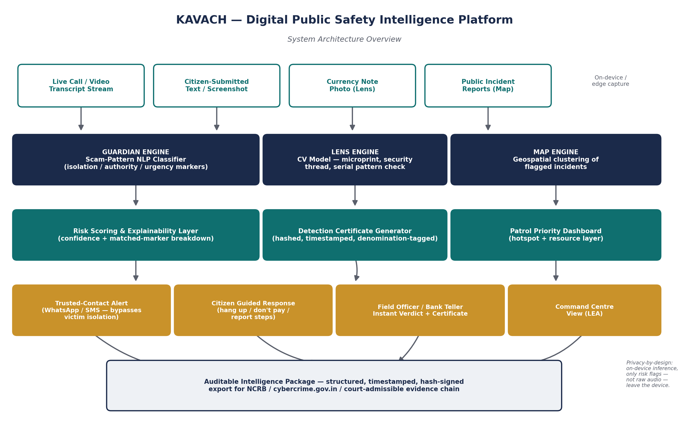

# Kavach — System Architecture



## Overview

Kavach has three modules that share a common design principle: every
output is structured to be explainable and auditable, not just a bare
verdict.

```
Input layer          Processing layer        Risk/Decision layer         Action layer
─────────────        ─────────────────        ─────────────────────      ─────────────
Call transcript  →    Guardian classifier  →   Risk score +           →   Trusted-contact
stream                (guardian/classifier)    matched-marker             alert (bypasses
                                                explanation                victim isolation)

Currency note    →    Lens CV pipeline     →   Confidence score +     →   Hash-signed
photo                 (lens/detection)         region heatmap             certificate

Incident reports →    Map aggregation      →   Hotspot clustering     →   Command-centre
                       (map/dashboard)                                     dashboard
```

## 1. Guardian — Digital Arrest Scam Detection

- **Input:** short transcript snippets from a call/video (in production,
  fed continuously by a speech-to-text front end; in this prototype, text
  is passed directly).
- **Classifier** (`guardian/classifier/model.py`): TF-IDF + Logistic
  Regression pipeline trained on a hand-authored taxonomy of six scam
  marker categories (see `guardian/classifier/patterns.json`).
- **Call-level risk assessment** (`assess_call_risk`): aggregates
  per-snippet predictions across a call, reports how many distinct
  markers were matched (e.g. "3 of 6"), and recommends a trusted-contact
  alert once 2+ distinct markers are matched.
- **Alert service** (`guardian/alert_service/alert.py`): on a high-risk
  verdict, sends a plain-language alert to a pre-designated trusted
  contact via WhatsApp — deliberately not interrupting the victim's own
  screen, since scammers actively watch for the victim breaking away.
- **Privacy design:** only structured risk flags (label, confidence,
  matched markers) are ever transmitted off-device — never raw audio,
  video, or full transcripts.

## 2. Lens — Counterfeit Currency Detection

- **Input:** a photo of a currency note.
- **Region-based heuristic analysis** (`lens/detection/model.py`): checks
  edge density in three defined regions (security thread, microprint
  zone, serial number zone) against thresholds, producing a per-region
  pass/fail and an overall confidence score.
- **Heatmap** (`lens/detection/heatmap.py`): draws colored boxes on the
  note image showing exactly which region passed or failed —
  explainability for the field officer or bank teller using the tool.
- **Certificate generation** (`lens/detection/certificate_gen.py`):
  packages the verdict into a timestamped, SHA-256 hash-signed JSON
  certificate for recordkeeping and evidentiary use.

## 3. Map — Geospatial Crime Pattern Intelligence

- **Input:** flagged incidents from Guardian and Lens, or (in production)
  a live authorized feed from NCRB / state cybercrime cells / the 1930
  helpline.
- **Dashboard** (`map/dashboard/app.py`): a Streamlit command-centre view
  with filters by city, incident type, and severity, plus hotspot
  visualization for patrol prioritization.
- **Current state:** uses clearly labeled synthetic sample data
  (`map/sample_data/incidents.csv`) since no live authorized feed is
  available for a hackathon prototype.

## Data Flow Summary

1. Input captured (transcript / photo / incident report).
2. Module-specific model produces a structured, explainable output —
   never a bare "yes/no."
3. Risk/decision layer converts that output into an action: alert a
   trusted contact, generate a certificate, or surface on the dashboard.
4. Every action layer output is logged (alert log, certificate files) so
   it can later be exported as part of an auditable intelligence package.

## Known Limitations (stated openly)

- Guardian's classifier is trained on ~100 hand-authored examples — see
  `guardian/classifier/results.md` for honest, cross-validated
  performance numbers and explicit limitations.
- Lens uses heuristic image analysis, not a model trained on a real,
  authorized counterfeit-currency dataset — see the docstring in
  `lens/detection/model.py`.
- Map uses synthetic sample data pending a live authorized data-sharing
  agreement with law enforcement.

These limitations are documented deliberately rather than hidden, in
line with the submission's emphasis on auditability.
